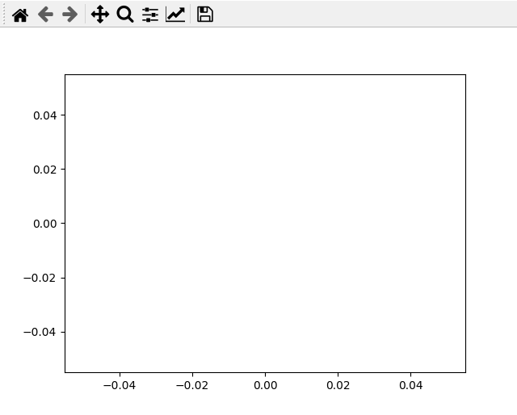

# Animate in Python - 101

## [Shantanu Dash](https://shantanu.rocks)

## What's Animation?

>Animation is a method in which figures are manipulated to appear as moving images. In traditional animation, images are drawn or painted by hand on transparent celluloid sheets to be photographed and exhibited on film. Today, most animations are made with computer-generated imagery. _Wikipedia_

So basically what we need to do is create a sequency of multiple images appearing one after another.

This can be translated basically in pseudocode as:
- show an image
- keep it for some milliseconds
- erase/remove that image and show the next image
- repeat the last two steps

_( Human eyes percieve >=30 frames/picture per second as fluid motion/video i.e. the animation does not appear jaggy if the frames per second is more than equal to 30.)_

## The Python way

So Python has multiple libraries and methods to animate things. I'll address methods which do not require any extra installations or modules and very basic things.

### 1. The instinctive method

_This works in any IDE( Spyder, Python3, etc) and Jupyter Notebooks, basically any **offline** way to do python._

If your graphs do not appear in a different window like this:


Type `%matplotlib qt5` on the console of your IDE or in a code cell of Jupyter Notebook.

Here's a simple example:


```python
%matplotlib qt5
```


```python
import numpy as np
import matplotlib.pyplot as plt
```


```python
for i in range(-4,4):
    plt.grid(True)#showing gridview for better viewing
    
    # we need to set a strict frame so that the view does not change for each loop
    plt.xlim(-5,5)
    plt.ylim(-5,5)
    
    
    plt.plot(i,0,'ro')#plotting a red dot
    
    plt.pause(0.2)#pausing for 0.2 seconds
    
    plt.clf()#clearing the frame
```

You can see the output below:



You could increase the number of loops,decrease the distance between the points or decrease the pause time to make the animation more fluid. _(Think of a flipbook animation for analogy and proper mindset.)_

### 1b. Making a video using ffmpeg

This method requires you to install and additional module `ffmpeg-python` which compiles a series of images into a video file. [Here's an example (Click This!)](https://colab.research.google.com/drive/1zx1a_N2O89cz1CMj1SLeZ_uPuMTveNoT?usp=sharing).

You can always [Google your way into knowing and exploring more.](https://google.com)

### 2. FuncAnimation function from matplotlib

This is an inbuilt way to do animation, though it's a bit cumbersome, it works great when you get it right and can be used in even online notebooks like [Google Colab](https://colab.research.google.com/)

[Here's a great tutorial](https://www.geeksforgeeks.org/matplotlib-animation-funcanimation-class-in-python/) , and again Google.

## Resources for IPython library Widgets:

- https://kapernikov.com/ipywidgets-with-matplotlib/
- [Documentation](https://ipywidgets.readthedocs.io/en/latest/)
- [A great Video demo building a GUI app](https://www.youtube.com/watch?v=f0WmLo8AVxo])
- [Another great video giving insight to Widgets](https://www.youtube.com/watch?v=VtchVpoSdoQ)

_Note: widgets only work in notebook environment like Jupyter or Google Colab._

[Here's my program for transformation of matrices.](https://colab.research.google.com/drive/1vP9nLFEj5oYKx1sJHsykmL6bG8sD0nrK?usp=sharing)
You can download this too by going to the file tab in Colab Notebook and use in local Jupyter Notebook.

